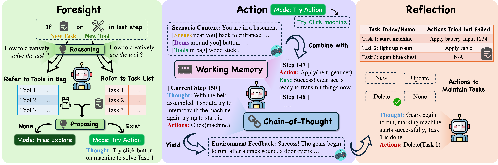

# 🚪 EscapeBench: Enhancing LM Agent Creativity
This repo contains the official evaluation code and dataset for the paper "EscapeBench: Towards Advancing the Creative Intelligence of Language Model Agents"

This benchmark is designed to test the creativity of language models (LMs). It includes benchmark data, implementations of BaseAgent and EscapeAgent, and scripts for running tests.



## 🔍 Quick Start
First, install all the required packages by running:
```bash
pip install -r requirements.txt
```

### Using OpenAI API
To use the OpenAI API as the core agent model, fill in your API key in `secret.json`:
```json
{
    "api_key": "your/api/key",
    "base_url": "your/base/url"
}
```

For benchmarking BaseAgent, use `scripts/run_base.sh`; for benchmarking EscapeAgent, use `scripts/run_creative.sh`. Before running, modify the following hyperparameters:
```txt
<API model name>: The OpenAI model for testing (e.g., gpt-4).
<games>: The games to try, selected from available game settings in `data/<game>.yaml` (supports multiple games, e.g., game2-1, game2-3-hard).
<suffix mark>: A suffix to distinguish different runs in the output directory.
```

After configuring these settings, run the following command:
```bash
bash scripts/run_base.sh
or
bash scripts/run_creative.sh
```

### Using Open-Sourced Models
To use a Hugging Face model as the core agent, deploy the model through the vLLM framework. First, set the target model name in `deploy_vllm_model.py` and adjust the hyperparameters according to your hardware:
```python
# Load the vLLM model
llm = LLM(
    model="path/to/your/model",
    tensor_parallel_size=1,  # Adjust based on your hardware
    dtype="bfloat16",
    ...
)
```
Once adjusted, deploy the model by running:
```bash
python deploy_vllm_model.py
```

For benchmarking BaseAgent, use `scripts/run_base_opensource.sh`; for benchmarking EscapeAgent, use `scripts/run_creative_opensource.sh`. The hyperparameters are the same as when using the OpenAI API.

After configuring the settings, run:
```bash
bash scripts/run_base_opensource.sh
or
bash scripts/run_creative_opensource.sh
```

### Human Player
We also support human players for the game. To play, specify the game in `scripts/run_human.sh`:
```txt
<game>: Fill in the game you want to play (e.g., game1-1). Note that only one single paly is supported.
```

For human player mode, you can save your progress and continue from where you left off by specifying `--load_from` to load existing backed-up progress.

To simplify the human playing experience, only input the index to represent the tool or item for each action. Some valid action examples are:
```txt
move(1): move to the scene indicated by <1> ...
apply(2, 3): apply the <2> tool in bag to the <3> item in scene
input(red, 4): input 'red' to item <4>
exit
```

## 📖 File Structure
Under the src/ directory:
* `agent_base.py`: Implementation of BaseAgent
* `agent_creative.py`: Implementation of EscapeAgent
* `human.py`: Interface for human player
* `env/`: Core game engine design, including scene, item, tool, etc.

Under the data/ directory:
* `<game>.yaml`: Game setting file for different difficulty levels
* `check_data.py`: A script to check for logical errors in the game data, such as misspellings, unmatched apply-wait pairs, etc.
* `reference/`: A successful action chain toward 100% completion, used as help hints.

For each game setting, the data logic is organized as:
```
- name: <scene name>
  desc: <scene description>
  scene_relations:
    <prompt>: <nearby scene name>
    ...
  items: 
  - position: <position of item>
    item:
      name: <item name>
      interactable: <True/False>
      visible: <True/False>
      states:
      - desc: <item description>
        neg_reward: <negative env feedback if wrong action is tried>
        transitions:
        - wait_for:
          - <waited action> [click], [apply <tool name>], [input <str>]
          trigger:
          - <trigger effect> [change_visible, scene/item/tool, <name>, True/False], [change_interact, item, <name>, True/False], [change_state, item/tool, <name>, <int>], [become_tool, <name>]
          reward: <positive env feedback if correct action is performed>
  tools:
    - position: <position of tool>
      tool:
        name: fragment
        visible: <True/False>
        states:
          - desc: <tool description>
            [apply_to/wait_for]:
              - <tool name>
```
Feel free to create you own room escape logic design based on our framework! Be creative!

## 🏆 Leaderboard
Here is the current leaderboard for EscapeBench performance across different models:

| Rank | Agent Model           | Total Steps | Hint Usage |
|------|-----------------------|-------------|------------|
| 1    | Claude-3.5-Sonnet     | 8.97        | 690.31     |
| 2    | GPT-4o                | 10.30       | 723.61     |
| 3    | Gemini-1.5-pro        | 11.06       | 824.31     |
| 4    | Llama-3.1-70B         | 14.53       | 982.42     |
| 5    | GPT-4o-mini           | 15.19       | 1002.39    |
| 6    | Qwen2.5-72B           | 16.50       | 1102.50    |
| 7    | Yi-1.5-34B            | 24.00       | 1573.33    |
| 8    | Ministral             | 25.31       | 1556.97    |
| 9    | DeepSeek-LLM-67B      | 25.50       | 1558.47    |
| 10   | Llama-3.1-8B          | 25.86       | 1543.30    |

## 🖊️ Citation

## Acknowledgement
